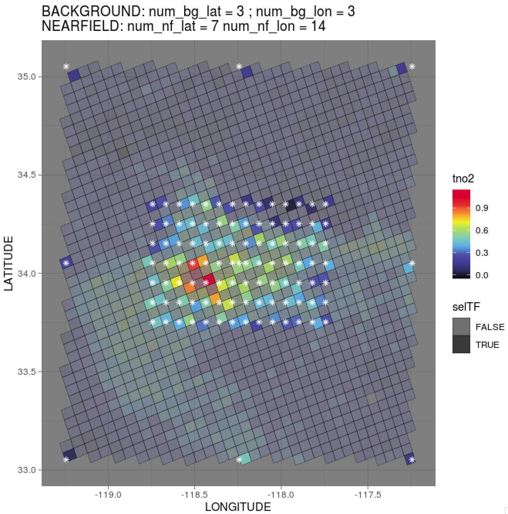

Commit by June 16, 2022
============
Code refactoring for transport error estimates and sounding selections for non-CO2 species. 

:pushpin: Sounding selections:

* `nf_dlat` and `nf_dlon`: define the NEAR-FIELD regions around `site`
* `dlat` and `dlon`: define the ENTIRE target regions around `site`

* `num_nf_lat` * `num_nf_lon`: total # of soundings to be selected along either the latitudinal or longitudinal direction (e.g., ~7 * 14 total soundings over the NEAR-FIELD domain around `site`)

* `num_bg_lat` * `num_bg_lon`: total # of soundings to be selected along either the latitudinal or longitudinal direction (e.g., ~3 * 3 total soundings over the FAR-FIELD or BACKGROUND domain around `site`)

* `get.recp.sensorv2()`: function for the selection of satellite soundings to save computational cost; If selected near- or far-field soundings share the same coordinate, only one of them will be treated as model receptor. 

Figure - An example of sounding selections (though not highly recommended for TROPOMI given its coarse resolution). 

Commit by July 6, 2021
============
Changes to ['merge_stilt-hysplit' branch](https://github.com/uataq/X-STILT/tree/merge_stilt-hysplit) towards the release of X-STILT version 2 that can work with non-OCO sensors or without the dependence of satellite data:

:pushpin: X-STILT can now work with TROPOMI X-gas data, such as 
   * footprint weighting using TROPOMI species-specific averaging kernels;

   * functions to grab vertical column density and convert to vertical mixing ratio in ppb; 

   * need to specify TROPOMI info via `obs_sensor` and `obs_species` that are currently limited to CO, CH4, and NO2;

:pushpin: IDEAL simulations for column footprints/enhancements from any locations (no requirement of satellite data).
   * To use the ideal mode, `obs_sensor` needs to be set as NA; 
   * Column AK is simply treated as 1 from TOA to the surface (`ak_wgt` is forced as FALSE);
   * Column PWF is calculated using modeled variables/profiles (`pwf_wgt` = TRUE). 

   * Must provide a .csv/.txt file containing the latitudes (`lati`) and longitudes (`long`) of your desired receptor locations. Receptor time (in form of YYYYMMDDHH or YYYYMMDDHHss) can either be included in the csv/txt file as the 3rd column (with name of `time`) OR assigned to `timestr` in `run_xstilt.r`. See example of `receptor_demo.csv`. 
   
   * [USE WITH CAUTIONS] NOT suitable for comparisons with real satellite sensors that have variable vertical sensitivities.

:pushpin: **Built upon the latest HYSPLITv5**: Replace discrete release levels with *line source release* -- i.e., particles are now evenly distributed between `minagl` and `maxagl`, e.g., default is 3000 particles from 0 - 3km; 

:pushpin: PWF calculations in `r/src/recp_trajec_foot`

   * Instead of interpolate PWF from OCO-2 to each discrete release level :arrow_forward: calculate PWF based on dp and dry air column density (mol m-2) between particles. 

   * To calculate the dry air X-density, we extracted specific humidity and temperature profiles via `get.met.vars()`. 

   * If ak.wgt is turned off (`ak.wgt` == FALSE), the dependence on any satellite sensors will be removed. That being said, normalied AK is 1 and PWF is calculated based on MODELED surface pressures instead of RETRIEVED surface pressures. 

:pushpin: Other minor changes: 
   * Allow the calculation of another set of footprint with a different temporal resolution from the default run at the same time, e.g., hourly footprint implied by `time_integrate2 = F`;

   * Add interactive mode for choosing site, overpass time, etc. One can modify the code to turn it off;

   * Insert the google API as the first line of `insert_ggAPI.csv` that will be sourced by the model for geolocation and google map plotting; 

   * Get rid of the additional .rds files end with X_wgttraj.rds to reduce file sizes :arrow_forward: trajectory-level footprints after the AK and PWF weighting are now stored as additional columns in the initial *X_traj.rds files. Here are the descriptions of columns in output$particle from rds files: 
      * `foot_before_weight:` footprint BEFORE AK and PWF weighting;
      * `foot:` footprint AFTER AK and PWF weighting; 
      * `pwf, ak.norm, ap, ak.pwf:` computed pressure weighting and interpolated apriori and averaging kernel profiles from OCO-2/3; 
      * `wgt:` final weighting factors used for scaling trajectory-level footprint based on flags of `ak.wgt` and `pwf.wgt`. 
