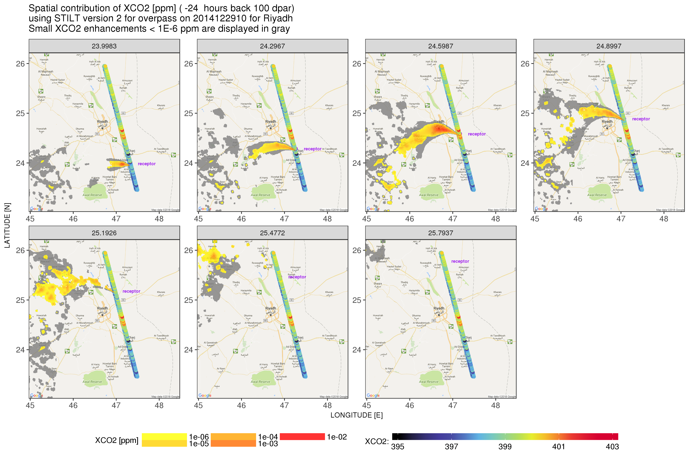

# X-STILT: Column-Stochastic Time-Inverted Lagrangian Transport model
## Descriptions:
Scripts and subroutines for X-STILT, modified from the Stochastic Time-Inverted Lagrangian Transport (STILT) model [*Lin et al*., 2003] and STILT-R version 2 [*Fasoli et al*., 2018]. Methodology is based on [*Wu et al*., 2018] (in review on *Geoscientific Model Development Discussion*). Detailed descriptions can be found in each directory (*archive_v1.1* and *lastest_v2.0*).

Developments are still ongoing towards a more flexible model framework that can be more easily applied to other column measurements. Contributions from other users are welcomed and highly appreciated. Please contact Dien (Dien.Wu@utah.edu) if you have any questions/comments/suggestions.

## Examples:

Figure 1: Spatial map of XCO2 contribution (ppm) on 12/29/2014 for selected soundings/receptors over Riyadh

## Reference:
Wu, D., Lin, J. C., Oda, T., Ye, X., Lauvaux, T., Yang, E. G., and Kort, E. A.: A Lagrangian Approach Towards Extracting Signals of Urban CO2 Emissions from Satellite Observations of Atmospheric Column CO2 (XCO2): X-Stochastic Time-Inverted Lagrangian Transport model ("X-STILT v1.1"), Geosci. Model Dev. Discuss., https://doi.org/10.5194/gmd-2018-123, in review, 2018.

Fasoli, B., Lin, J. C., Bowling, D. R., Mitchell, L., and Mendoza, D.: Simulating atmospheric tracer concentrations for spatially distributed receptors: updates to the Stochastic Time-Inverted Lagrangian Transport model's R interface (STILT-R version 2), Geosci. Model Dev., 11, 2813-2824, https://doi.org/10.5194/gmd-11-2813-2018, 2018.

Lin, J.C., Gerbig, C., Wofsy, S.C., Andrews, A.E., Daube, B.C., Davis, K.J. and Grainger, C.A., 2003. A near‐field tool for simulating the upstream influence of atmospheric observations: The Stochastic Time‐Inverted Lagrangian Transport (STILT) model. Journal of Geophysical Research: Atmospheres, 108(D16).
