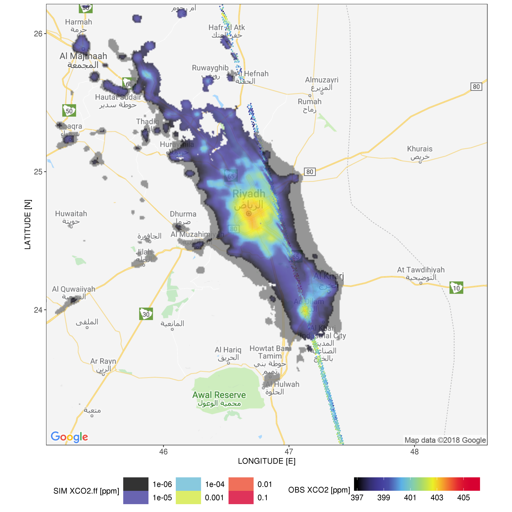

# X-STILT: Column-Stochastic Time-Inverted Lagrangian Transport model

X-STILT is an atmospheric transport model that deals with vertically integrated column concentrations of various trace gases ([*Wu et al*., 2018](https://doi.org/10.5194/gmd-11-4843-2018)). The model code was built upon the Stochastic Time-Inverted Lagrangian Transport (STILT) model ([*Lin et al*., 2003](https://doi.org/10.1029/2002JD003161)) and its [latest version 2](https://github.com/uataq/stilt) ([*Fasoli et al*., 2018](https://doi.org/10.5194/gmd-11-2813-2018)). 

This GitHub repo has built-in scripts/functions for 
1. running backward trajectories from an atmospheric column and column footprint (start with `run_xstilt.r`); 
2. running forward-time trajectories from a box around the site and compute background from satellite observations (start with `compute_bg.r`); 
3. and estimating wind and PBL uncertainties and translating those into XCO<sub>2</sub> uncertainties (start with `run_xstilt.r`)

**The model framework can now work with OCO-2&3 XCO<sub>2</sub> and TROPOMI XCO ([*Wu et al*., ACPD](https://acp.copernicus.org/preprints/acp-2021-1029/)), CH<sub>4</sub>, and NO<sub>2</sub> and will be available for [TCCON](https://tccon-wiki.caltech.edu/) and EM27.** :sunglasses: 

Model developments are ongoing and contributions are welcomed and appreciated. Please contact Dien (dienwu@caltech.edu) if you are interested in other column sensors/species or have any questions.

# X-STILT Features
## Table of Contents
- [**Recent commits**](HISTORY.md)
- [**Download and install model**](#download-and-install-model)
- [**Prerequisites**](#prerequisites)
- [**Obtain column footprint**](#obtain-column-footprint)
- [**Determine background XCO<sub>2</sub>**](#determine-background-xco2)
- [**Estimate horizontal and vertical transport errors**](#estimate-horizontal-and-vertical-transport-errors)
- [**Atmospheric inversion on XCO<sub>2</sub>**](#atmospheric-inversion-on-xco2)
- [**Example figures of column footprints and XCO<sub>2.ff</sub>**](#example-figures-of-column-footprints-and-xco2ff)
- [**Reference**](#reference)

Download and install model
============
   * As STILT-R version 2 now serves as a submodule of X-STILT, you will need to use the git command to download the entire model packages including the underlying STILTv2 and HYSPLITv5:
   ```
   git clone --recursive https://github.com/uataq/X-STILT.git
   ```

   * To automatically install all R packages (requiring R > 3.5.0) and the STILTv2 model with the fortran program for HYSPLITv5, start with the [first few lines of `run_xstilt.r`](https://github.com/uataq/X-STILT/blob/master/run_xstilt.r#L45-L47). 

   * Required datasets and methodologies are described in [prerequisites](prerequisites) and [*Wu et al*., 2018](https://doi.org/10.5194/gmd-11-4843-2018). Please refer to the [reference](#reference) section if you plan to publish any study using the (X-)STILT model. 


<!-- toc -->
Prerequisites
============
1. For **SATELLITE-dependent column simulation** - 
   * download [OCO-2 Lite](https://disc.gsfc.nasa.gov/datasets?keywords=OCO%20L2%20Lite%20FP&page=1) or [TROPOMI](https://disc.gsfc.nasa.gov/datasets?keywords=TROPOMI%20L2&page=1) Level 2 files and modify the corresponding parameters including `obs_sensor`, `obs_ver`, `obs_species`, `oco_path`, or `trp_path`. 
   * X-STILT reads in averaging kernels from satellite files but calculates its own pressure weighting functions to perform vertical weighting on footprint values for air parcels that releases from different altitudes and then provide the vertically compressed column footprints. 

2. For **IDEAL column simulation** WITHOUT satellite dependence - 
   * prepare a csv file for receptor `lon`, `lat`, and `time`. An example is provided as in `receptor_demo.csv`. Check out instructions in [recent commit](https://github.com/uataq/X-STILT/blob/master/HISTORY.md#commit-by-july-6-2021). 


3. Meteorological fields in ARL format, e.g., ones provided by [NOAA ARL](ftp://arlftp.arlhq.noaa.gov/archives/), and modify the section on [ARL format meteo params](https://github.com/uataq/X-STILT/blob/master/run_xstilt.r#L164-L179). One need to perform ARL conversion, e.g., when using WRF as the met fields. 

4. (OPTIONAL) For calculating column enhancements [in ppm] - 
   * choose your favourite emission inventories. The default is to use ODIAC for fossil fuel emission representation; so download [1 km ODIAC files](http://db.cger.nies.go.jp/dataset/ODIAC/DL_odiac2019.html) in tif format and modify `odiac_path`. 

5. (OPTIONAL) For performing transport error analyses - 
   * [NOAA radiosonde data](https://ruc.noaa.gov/raobs/) for computing model-data wind errors; please choose wind speed unit of tenths of m s-1 and FSL format; Users could download RAOB stations within a spatial area around `site`;
   * [Carbon-Tracker mole fraction data, e.g., CT-NRT](https://www.esrl.noaa.gov/gmd/ccgg/carbontracker/CT-NRT/) for getting the total XCO<sub>2</sub> in addition to FF XCO<sub>2</sub>. 

6. (OPTIONAL) For performing emission error analyses - 
   * Bottom-up emission inventories ensemble [FFDAS](http://ffdas.rc.nau.edu/index.html) and [EDGAR](https://edgar.jrc.ec.europa.eu/). 


Obtain column footprint
============
*Column Footprints* [ppm / (umol m<sup>-2</sup> s<sup>-1</sup>)] are the source-receptor sensivities or essentially the Jacobian Matrics between concentration (enhancements) and fluxes (for a given source/sink). Users can start with `run_xstilt.r` for model and parameter initializations.

1. Select a satellite overpass. Either by a manual insertion Or an automatic search. By default, [STEP 1](https://github.com/uataq/X-STILT/blob/master/run_xstilt.r#L102-L116) searches for all overpasses that have soundings falling into a spatial domain (e.g., [2 deg x 2 deg](https://github.com/uataq/X-STILT/blob/master/run_xstilt.r#L57-L58)) as well as a near-field domain (i.e., [0.6 deg x 0.6 deg](https://github.com/uataq/X-STILT/blob/master/run_xstilt.r#L59-L60)).

2. Select the kind of simulation one would like to conduct in [STEP 2](https://github.com/uataq/X-STILT/blob/master/run_xstilt.r#L120-L132). One needs to modify logical flags which included:

   >* `run_trajec = T or run_foot = T`: Backward trajectories + vertically weighted column footprints;

   >* `run_hor_err = T`: Horizontal transport error analysis (one needs to calculate wind error statistics first, see below); 

   >* `run_wind_err = T`: Modeled wind error estimates against radiosonde data (one need to download them from NOAA webpage first); 

   >* `run_ver_err = T`: Vertical transport error analysis (via scaling mixed layer height up and down with scaling factors stated in [STEP 4](https://github.com/uataq/X-STILT/blob/master/run_xstilt.r#L253-L256));

   >* `run_sim = T`: Simulate FFCO2 XCO<sub>2</sub> enhancements (requires footprint), remember to turn off `run_trajec` and `run_foot`;

   >* `run_emiss_err = T`: Prior emission error analysis (requires footprint).

3. Modify parameters for placing column receptors (e.g., max height and vertical spacing between two vertical levels in meters, # of particles per level, receptor locations). By default, X-STILT chooses more receptors within NEAR-FIELD area, see [STEP 3](https://github.com/uataq/X-STILT/blob/master/run_xstilt.r#L135-L160).

4. Modify meteorological fields, [STEP 4](https://github.com/uataq/X-STILT/blob/master/run_xstilt.r#L164-L179). See [STILT documentation](https://uataq.github.io/stilt/#/configuration?id=meteorological-data-input) for more explanations. 

5. Modify horizontal resolution and spatial extent of footprint, [STEP 5](https://github.com/uataq/X-STILT/blob/master/run_xstilt.r#L182-L214). 
   * X-STILT can generate multiple sets of footprints based on the same set of trajectory in one simulation (hourly-integrated or hourly-explicit footprints). For generating a second or third set of footprints, modify these [params](https://github.com/uataq/X-STILT/blob/master/run_xstilt.r#L202-L214). 

6. Set up SLURM parallel computing, [STEP 6](https://github.com/uataq/X-STILT/blob/master/run_xstilt.r#L241-L260).


Determine background XCO<sub>2</sub>
============
Start with main script of `compute_bg.r`. [M3 is the overpass specific background [ppm]](https://github.com/uataq/X-STILT/blob/master/compute_bg.r) by releasing air parcels in a forward fashion from a city and determining urban plume and background region using 2D kernel density. Please refer to details described in [Sect. 2.3 in Wu et al. (2018)](https://www.geosci-model-dev.net/11/4843/2018/#section2).

   >* `run_trajec = T`: calculate forward-time trajectories from a small box around the site (see parameter `box.len` and other parameters in STEP 2) no matter if those trajectories had been calculated previously. In this mode, air parcels are released continuously for every `dtime.sep` hours (see parameter `dtime.*`);

   >* `run_trajec = T & run_for_err = T`: add a wind error component (controlled by parameter `siguverr`) while calculating forward-time trajectories;

   >* `run_wind_err = T`: calculate modeled wind errors against radiosonde data (one need to download them first);

   >* `run_bg = T`: calculate the background values based on OCO-2/3 or TROPOMI data (see parameters in STEP 4); the inner functions will generate plots of plumes and observed enhancements by assuming background region to the north/south/east/west outside the plume. The final estimated background values will be stored in `file.path(store_path, fn)` if `writeTF = T`. 


Estimate horizontal and vertical transport errors
============
Instead of using model ensembles for estimating errors, X-STILT propagates real-world random u-v- wind errors (with correlation length scale and timescale) into errors in XCO<sub>2</sub>. The fundamental approach is proposed and documented in [Lin and Gerbig, 2005](https://agupubs.onlinelibrary.wiley.com/doi/epdf/10.1029/2004GL021127), which is now extended to column CO2. We calculate and propagate XCO<sub>2</sub> errors from release levels, to receptor locations, and finally to overpasses. 

Briefly speaking, users need to first generate another set of trajectories with wind error statistics (i.e., blue dots in Fig. S4) by turning on `run_hor_err`. Once trajectories with wind errors have been generated, one need to turn on `run_sim` to let X-STILT calculate the errors in XCO<sub>2</sub> based on two sets of trajectories (with/without wind errors). Hard to explain all the steps here, but feel free to contact Dien if one is interested in performing such error estimates. Please also refer to details described in [Sect. 2.6 in Wu et al. (2018)](https://www.geosci-model-dev.net/11/4843/2018/#section2).


Atmospheric inversion
============
As discussed in [Sect. 4.2 in Wu et al. (2018)](https://www.geosci-model-dev.net/11/4843/2018/#section4), we could come up the posterior scaling factor for anthropogenic emissions based on 5 overpasses over Riyadh, via a simple Bayesian Inversion. We treated the entire city as a whole and solve for one scaling factor, given biases in near-field wind direction. So, we did not solve for posterior emissions for every grid cell within a city. Codes are not included in this repo. 

Example figures of column footprints and XCO<sub>2.ff</sub>
============


Figure - Latitude integrated map of weighted column footprints [umol m-2 s-1] on 12/29/2014 from 70+ selected sounding/receptor over Riyadh.



Figure - Latitude integrated XCO<sub>2</sub>.ff contribution maps [ppm] on 12/29/2014 from 70+ selected sounding/receptor over Riyadh.


Reference
============
## Model development 
**Initial X-STILTv1 paper**: 
Wu, D., Lin, J. C., Fasoli, B., Oda, T., Ye, X., Lauvaux, T., Yang, E. G., and Kort, E. A.: A Lagrangian approach towards extracting signals of urban CO2 emissions from satellite observations of atmospheric column CO2 (XCO<sub>2</sub>): X-Stochastic Time-Inverted Lagrangian Transport model (“X-STILT v1”), *Geosci. Model Dev.*, 11, 4843-4871, https://doi.org/10.5194/gmd-11-4843-2018, 2018. 

**STILTv2 paper**: 
Fasoli, B., Lin, J. C., Bowling, D. R., Mitchell, L., and Mendoza, D.: Simulating atmospheric tracer concentrations for spatially distributed receptors: updates to the Stochastic Time-Inverted Lagrangian Transport model's R interface (STILT-R version 2), *Geosci. Model Dev.*, 11, 2813-2824, https://doi.org/10.5194/gmd-11-2813-2018, 2018.

**Initial STILTv1 paper**: 
Lin, J.C., Gerbig, C., Wofsy, S.C., Andrews, A.E., Daube, B.C., Davis, K.J. and Grainger, C.A.: A near‐field tool for simulating the upstream influence of atmospheric observations: The Stochastic Time‐Inverted Lagrangian Transport (STILT) model. *Journal of Geophysical Research: Atmospheres*, 108(D16), https://doi.org/10.1029/2002JD003161. 2003. 

**STILT error uncertainties**: 
Lin, J. C., and Gerbig, C., Accounting for the effect of transport errors on tracer inversions, *Geophys. Res. Lett.*, 32, L01802, https://doi.org/10.1029/2004GL021127, 2005.

## Model applications 
**X-STILT for TROPOMI XCO**: Wu, D., Liu, J., Wennberg, P. O., Palmer, P. I., Nelson, R. R., Kiel, M., and Eldering, A.: Towards sector-based attribution using intra-city variations in satellite-based emission ratios between CO2 and CO, Atmos. Chem. Phys. Discuss. [preprint], https://doi.org/10.5194/acp-2021-1029, in review, 2022.

