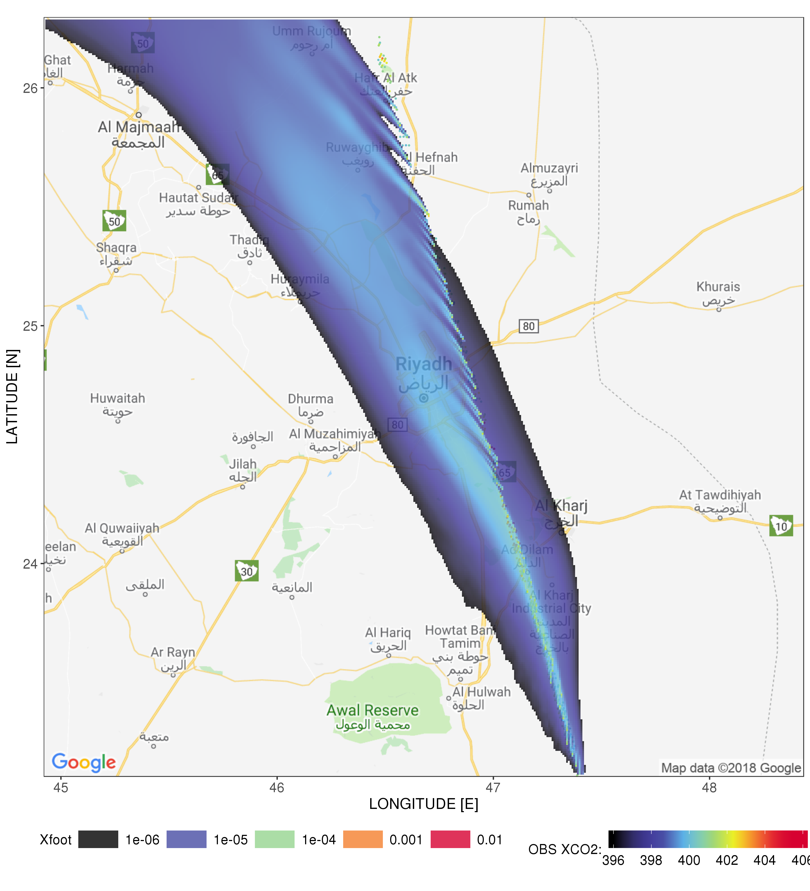

# X-STILT: Column-Stochastic Time-Inverted Lagrangian Transport model
## Descriptions:
Scripts and subroutines for X-STILT, modified from the Stochastic Time-Inverted Lagrangian Transport (STILT) model [*Lin et al*., 2003] and STILT-R version 2 [*Fasoli et al*., 2018]. Methodology is based on [*Wu et al*., 2018] (in review on *Geoscientific Model Development Discussion*).

Model developments are ongoing towards a more flexible model framework that can be more easily applied to other column measurements. Contributions from other users are welcomed and highly appreciated. Please contact Dien (Dien.Wu@utah.edu) if you have any questions/comments/suggestions. Thank you.

## Details for X-STILTv2.0 based on STILT-R version 2 [*Fasoli et al*., 2018]:
We're been merging column features with the new STILT-R version 2 [*Fasoli et al*., 2018] with improved model efficiency and more realistic "footprint" values (https://uataq.github.io/stilt/). Still, one can use Trajecfoot() from STILTv1 for generating footprints, if setting stilt.ver to 1.
Modifications on top of STILTv2 are located in /src/oco2-xsilt. Users can start with 'create_namelist_oco2-xsilt.r' for model and parameter initializations.

- X-STILTv2 features:
1. Select OCO-2 overpasses and make spatial plots of retrieved XCO2 given a city
2. Select OCO-2 soundings based on latitude binwidths for each overpass
3. Create namelist with model parameters
4. Model runs and analysis included:
   * Backward trajectories + weighted column footprints        -> *run_trajec/run_foot*
   * Forward trajectories + 2D kernel density maps             -> *forwardTF*
   * Horizontal transport error (wind error statistics needed) -> *run_hor_err*
   * Vertical transport error via scaling mixed layer height   -> *run_ver_err*
   * Simulate FFCO2 XCO2 enhancements (footprint needed)       -> *run_sim*

## Example plots:

Figure 1: Latitude integrated map of weighted column footprints [umol/m2/s] on 12/29/2014 from 70+ selected sounding/receptor over Riyadh.

Figure 2: Latitude integrated XCO2.ff contribution maps [ppm] on 12/29/2014 from 70+ selected sounding/receptor over Riyadh.

## Reference:
Wu, D., Lin, J. C., Oda, T., Ye, X., Lauvaux, T., Yang, E. G., and Kort, E. A.: A Lagrangian Approach Towards Extracting Signals of Urban CO2 Emissions from Satellite Observations of Atmospheric Column CO2 (XCO2): X-Stochastic Time-Inverted Lagrangian Transport model ("X-STILT v1.1"), Geosci. Model Dev. Discuss., https://doi.org/10.5194/gmd-2018-123, in review, 2018.

Fasoli, B., Lin, J. C., Bowling, D. R., Mitchell, L., and Mendoza, D.: Simulating atmospheric tracer concentrations for spatially distributed receptors: updates to the Stochastic Time-Inverted Lagrangian Transport model's R interface (STILT-R version 2), Geosci. Model Dev., 11, 2813-2824, https://doi.org/10.5194/gmd-11-2813-2018, 2018.

Lin, J.C., Gerbig, C., Wofsy, S.C., Andrews, A.E., Daube, B.C., Davis, K.J. and Grainger, C.A., 2003. A near‐field tool for simulating the upstream influence of atmospheric observations: The Stochastic Time‐Inverted Lagrangian Transport (STILT) model. Journal of Geophysical Research: Atmospheres, 108(D16).
